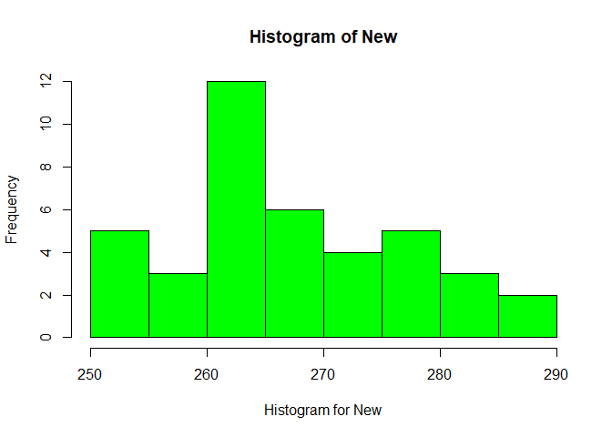

GolfBall\_HypothesisTest
================
Abhishek Kishore
25/06/2020

## Objective

The Par Inc. wants to compare the driving distances between the new golf
balls (new longer lasting balls with cut-resistance coating) and current
balls. To do this comparision, 40 balls of both the new and current
models were subjected to distance tests. The testing was performed with
a mechanical hitting machine so that any difference between the mean
distances for the two models could be attributed to a difference in the
design.

## Assumptions

Following assumptions had been made for driving the insights:

• The sample size is 40 (\>30). Hence as per Centeral Limit Theorem, the
sampling distribution of the mean will approach a normal distribution as
the size of the sample increases and becomes large (\>30). So it can be
assumed, Population distribution is normal.

• Observations are independent.

• Population standard deviation or the variance is same in both samples.

• Level of significance (α) = 0.05, as no specific level of significance
has been provided.

## Exploratory Data Analysis

``` r
str(golf)
```

    ## 'data.frame':    40 obs. of  2 variables:
    ##  $ Current: num  264 261 267 272 258 283 258 266 259 270 ...
    ##  $ New    : num  277 269 263 266 262 251 262 289 286 264 ...

Following had been observed for the provided data: • Number of
observations: 40 • Number of variables: 2 • Names of the variable:
Current & New • Current: This variable provides the observations for
current golf balls. • New: This variable provides the observations for
the new golf ball with coating designed to resist cuts.

# Missing values

``` r
sum(is.na(golf))
```

    ## [1] 0

• No Missing values found

# Dataset Summary

``` r
summary(golf)
```

    ##     Current           New       
    ##  Min.   :255.0   Min.   :250.0  
    ##  1st Qu.:263.0   1st Qu.:262.0  
    ##  Median :270.0   Median :265.0  
    ##  Mean   :270.3   Mean   :267.5  
    ##  3rd Qu.:275.2   3rd Qu.:274.5  
    ##  Max.   :289.0   Max.   :289.0

# Standard Deviation

``` r
sd(Current)
```

    ## [1] 8.752985

``` r
sd(New)
```

    ## [1] 9.896904

# Variation

``` r
var(Current)
```

    ## [1] 76.61474

``` r
var(New)
```

    ## [1] 97.94872

# Data Visualization

``` r
boxplot(Current, horizontal = TRUE, xlab = "Box plot for Current", col = "blue")
```

<!-- -->

``` r
boxplot(New,horizontal = TRUE, xlab = "Box plot for New", col = "green")
```

<!-- -->

``` r
hist(Current, xlab = "Histogram for Current", col = "blue")
```

<!-- -->

``` r
hist(New,xlab = "Histogram for New", col = "green")
```

<!-- -->

• Current: The minimum value is 255 yards and the maximum value is 289
yards. The average value is 270.3 yards

• New: The minimum value is 250 yards and the maximum value is 289
yards. The average value is 267.5 yards

It can be noticed that the differnce between the mean and median of the
current and new golf balls is not big and there are no outliers (extreme
small or big values).

The distribution of the new golf balls is right skewed. This indicates,
the new golf balls covered shorter distances more and few large
distances. The new balls also have a high variation as compared to
current balls.

## Hypothesis

• Null hypothesis; H0: µCurrent = µNew (there is no difference in
performance)

• Alternate Hypothesis; Ha: µCurrent \!= µNew (there is difference in
performance)

Where,

• µCurrent: Mean driving distance of current model golf ball

• µNew: Mean driving distance of new golf ball

As the indicated test is between two independent samples, we shall
perform two-tailed T-test.

# Two Sample T-Test

``` r
t.test(Current,New,paired = FALSE, var.equal = TRUE)
```

    ## 
    ##  Two Sample t-test
    ## 
    ## data:  Current and New
    ## t = 1.3284, df = 78, p-value = 0.1879
    ## alternative hypothesis: true difference in means is not equal to 0
    ## 95 percent confidence interval:
    ##  -1.383958  6.933958
    ## sample estimates:
    ## mean of x mean of y 
    ##   270.275   267.500

Since it is a two-tailed test, the p-value = 0.188 ÷ 2 = 0.094.

P-value (probability value from t-test) is 0.094, which more than that
assumed level of significance (α) of 0.05. Hence, we fail to reject the
null hypothesis H0.

# Conclusion

The Par Inc. should take the new golf balls in production as the p-value
indicate that there is no significant difference between estimated
population mean of current as well as new golf balls.

## Confidence Interval

# Analysis of Current Balls

``` r
t.test(Current)
```

    ## 
    ##  One Sample t-test
    ## 
    ## data:  Current
    ## t = 195.29, df = 39, p-value < 2.2e-16
    ## alternative hypothesis: true mean is not equal to 0
    ## 95 percent confidence interval:
    ##  267.4757 273.0743
    ## sample estimates:
    ## mean of x 
    ##   270.275

# Analysis of New Balls

``` r
t.test(New)
```

    ## 
    ##  One Sample t-test
    ## 
    ## data:  New
    ## t = 170.94, df = 39, p-value < 2.2e-16
    ## alternative hypothesis: true mean is not equal to 0
    ## 95 percent confidence interval:
    ##  264.3348 270.6652
    ## sample estimates:
    ## mean of x 
    ##     267.5

• With 95% confidence, we can say that the difference between the means
of the two population will be within the range of \[-1.38, 6.93\]

• With 95% confidence, we can say that the sample mean driving distance
of current balls will be within the range of \[267.48, 273.07\]

• With 95% confidence, we can say that the sample mean driving distance
of new balls will be within the range of \[264.33, 270.66\]

## Need of Larger Sample Size

To find the need for larger sample size, we shall perfrom PoWER of
T-TEST. In case, Power of T-Test is insignificant, we shall calculate
the sample number.

``` r
diff_mean = abs(mean(Current) - mean(New))

pooled_sd = sqrt((((length(Current)-1)*sd(Current)^2)+((length(New)-1)*sd(New)^2))/(length(Current)+length(New)-2))

power.t.test(n=40, delta = diff_mean, sd = pooled_sd,
             sig.level = 0.05, type = "two.sample",
             alternative = "two.sided")
```

    ## 
    ##      Two-sample t test power calculation 
    ## 
    ##               n = 40
    ##           delta = 2.775
    ##              sd = 9.342469
    ##       sig.level = 0.05
    ##           power = 0.2585147
    ##     alternative = two.sided
    ## 
    ## NOTE: n is number in *each* group

The Power of test is 0.258 or 25.8%. This means, the probability of
correctly rejecting the null hypothesis (when the alternate hypothesis
is true), is only 25%. Hence we need to revisit the number of samples to
increase the power of test.

# Recalculate Sample size using Power T Test

Calculating the Power Test considering:

  - Power of Test to be 95%

  - Significane level to be 0.188 as per the p-value calcuated in two
    sample T-Test.

<!-- end list -->

``` r
power.t.test(power=0.95, delta = diff_mean, sd=pooled_sd ,
             sig.level = 0.188,type = "two.sample", 
             alternative = "two.sided" )
```

    ## 
    ##      Two-sample t test power calculation 
    ## 
    ##               n = 199.2345
    ##           delta = 2.775
    ##              sd = 9.342469
    ##       sig.level = 0.188
    ##           power = 0.95
    ##     alternative = two.sided
    ## 
    ## NOTE: n is number in *each* group

Hence, we need sample size of approx. 200 in order to get 95% power of
Test.
